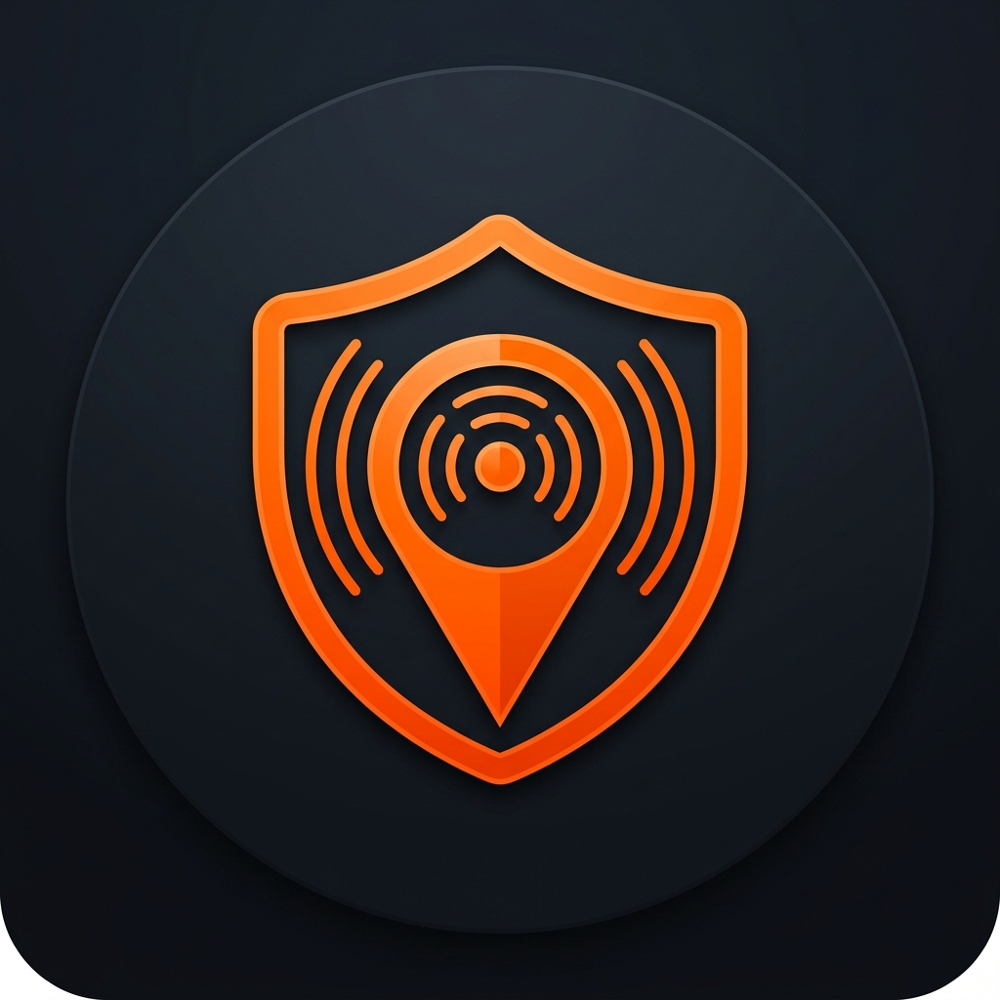

<div align="center">
  
  <h1>Sentinel</h1>
  <p><b>Next-Generation Emergency Alert & Incident Tracking System</b></p>
  <p>Built with React, FastAPI, and Mapbox</p>
  
  [](https://opensource.org/licenses/MIT)
  [](https://github.com/activ8st)
</div>

<br/>

## 🚨 About The Project

**Sentinel** is a modern, real-time incident tracking and emergency reporting web application. It empowers users to visualize critical localized events—such as natural disasters, accidents, or public safety alerts—on a highly interactive, full-screen map interface. 

The system features a dual-architecture: a blazing-fast React frontend and a powerful Python backend equipped with an autonomous data-scraping bot that constantly listens to official emergency channels (like INGV for earthquakes) and seamlessly pushes alerts to the UI.

## ✨ Features

-  **Full-Screen Interactive Map:** Powered by Mapbox GL with dynamic clustering and custom pulsing markers.
-  **Autonomous Data Bot:** A Python background worker (`scraper.py`) that fetches and normalizes official external data streams without slowing down the user experience.
-  **Real-Time Geolocation:** Instantly calculates your distance from critical incidents using the browser's Geolocation API.
-  **Premium UI/UX:** Responsive design, glassmorphism elements, dark/light mode toggle, and micro-animations built with Tailwind CSS and Framer Motion.
-  **Smart Notifications:** Persistent local storage alerts system with unread badges and contextual incident routing.
-  **Mobile-First & PWA Ready:** Flawless responsive layout that adapts from a desktop sidebar to a sleek mobile bottom navigation bar.

##  Tech Stack

### Frontend
- **Framework:** React 18 + Vite
- **Styling:** Tailwind CSS + Radix UI Headless Components
- **Maps:** Mapbox GL + `react-map-gl`
- **Animations:** Framer Motion
- **State Management:** React Query (TanStack Query)
- **Routing:** React Router v6

### Backend & Bot
- **Framework:** FastAPI (Python)
- **Database:** SQLite (SQLAlchemy ORM) - *Production ready for PostgreSQL*
- **Bot Engine:** Python `requests` + background scheduling via async workers.

## Getting Started

Follow these instructions to set up the project locally on your machine.

### 1. Clone the repository
```bash
git clone https://github.com/activ8st/SENTINEL.git
cd SENTINEL
```

### 2. Frontend Setup
Make sure you have Node.js installed.

```bash
# Install NPM dependencies
npm install

# Start the Vite development server
npm run dev
```
The frontend will be available at `http://localhost:5173`.

### 3. Backend & Bot Setup
Make sure you have Python 3.10+ installed.

```bash
# Navigate to the backend directory
cd backend

# Create a virtual environment
python -m venv venv

# Activate the virtual environment
# On Windows:
.\venv\Scripts\Activate
# On Mac/Linux:
source venv/bin/activate

# Install Python dependencies
pip install -r requirements.txt

# Start the FastAPI server (Runs on port 8000)
uvicorn main:app --reload --port 8000
```

### 4. Run the Data Scraper Bot (Optional)
To fetch live data from external sources (e.g., INGV earthquakes), run the bot in a separate terminal:
```bash
cd backend
.\venv\Scripts\Activate
python -m bot.main
```

## Author

**activ8st**
- GitHub: [@activ8st](https://github.com/activ8st)

## 📄 License

Distributed under the MIT License. See `LICENSE` for more information.
