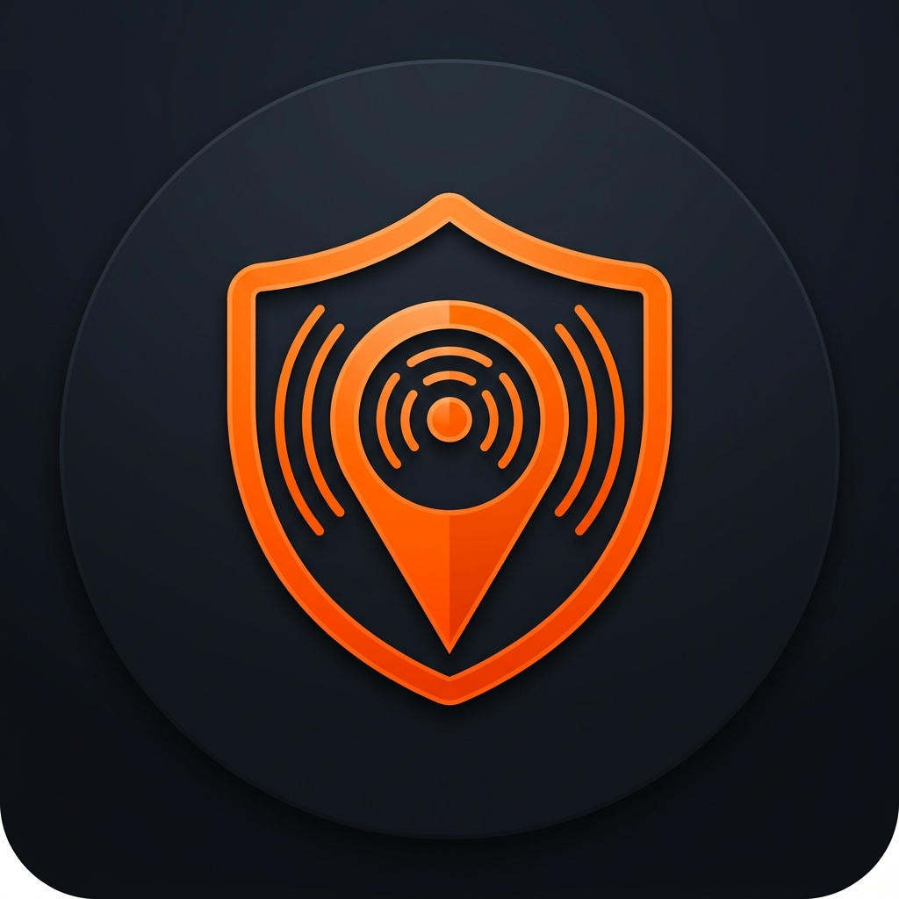

<div align="center">
  
  <h1>Sentinel — MVP Local Alert & Safety Network</h1>
  <p><b>Rete di Consapevolezza Cittadina e Tracciamento Incidenti in Tempo Reale</b></p>
  <p>Pilota Locale: Cesena / Forlì-Cesena / Emilia-Romagna</p>

  [](https://opensource.org/licenses/MIT)
  [](https://github.com/activ8st)
</div>

<br/>

## 🚨 Informazioni sul Progetto MVP

**Sentinel** è una piattaforma di sicurezza partecipata e consapevolezza locale che trasforma dati di cronaca ed emergenza (INGV, Vigili del Fuoco, cronaca locale) e segnalazioni cittadine in una mappa viva e interattiva in tempo reale.

Il progetto è attualmente configurato in modalità **Pilota Locale** concentrato sull'area di **Cesena**, la provincia di **Forlì-Cesena** e l'**Emilia-Romagna**.

---

## ✨ Funzionalità Principali

- 🗺️ **Mappa Interattiva 3D con Mapbox GL**: Visualizzazione ad alta precisione con clustering e perimetro reale.
- 🏷️ **Data Provenance & Trasparenza**: Ogni evento mostra metadati chiari (`official_feed`, `rss`, `user_community`, `demo`) e status di verifica (`official`, `verified`, `unverified`, `user_submitted`).
- 🔑 **Autenticazione Reale OTP**: Gestione OTP backend con hashing sicuro, scadenze, rate limiting e assenza di leak di codici nei log/toast.
- 🔒 **Protezione Rotte Applicative (`ProtectedRoute`)**: Rotte dell'app (`/Home`, `/MapView`, `/Notifications`, `/Profile`, `/Report`, `/IncidentDetail`) protette e accessibili solo agli utenti autenticati.
- 🛡️ **Disclaimer Soccorsi (112/115/118)**: Sentinel non sostituisce i numeri di emergenza. Inviando una segnalazione l'utente accetta l'obbligo del disclaimer d'emergenza.
- 📷 **Moderazione Preventiva dei Media**: Segnalazioni contenenti allegati foto/video o contenuti sensibili vengono posizionate in `pending_review` prima di essere pubblicate sulla mappa pubblica.
- ⚡ **Pannello & API Admin Protetti**: Endpoint `/api/admin/pending-incidents` e `/api/admin/moderate-incident` protetti da `X-Admin-Key`.
- ⚙️ **Configurazione `VITE_APP_MODE`**: Supporto per modalità `demo`, `production` e `pilot` (senza seeding automatico di mock data in produzione/pilot).

---

## 🛠️ Stack Tecnologico

- **Frontend**: React 18 + Vite, Tailwind CSS, Mapbox GL JS 3D, Dexie.js (IndexedDB), Framer Motion, TanStack Query, Lucide Icons.
- **Backend**: FastAPI (Python), SQLAlchemy ORM (SQLite/PostgreSQL), Pydantic v2.
- **Scraper & Ingestion Engine**: Worker background asincrono per feed INGV, Protezione Civile ed edizioni locali.

---

## 🚀 Istruzioni di Avvio Rapido

### 1. Clona il Repository
```bash
git clone https://github.com/activ8st/SENTINEL.git
cd SENTINEL
```

### 2. Frontend Setup
```bash
npm install
npm run dev
```

### 3. Backend Setup
```powershell
$env:PYTHONPATH="."
python -m uvicorn backend.main:app --host 127.0.0.1 --port 8000 --reload
```

### 4. Esecuzione Test & Build
```powershell
# Esegui la suite di test Pytest backend
$env:PYTHONPATH="."
python -m pytest -q

# Verfica il linting frontend
npm run lint

# Esegui la build di produzione frontend
npm run build
```

---

## 📚 Documentazione di Dettaglio

- 📋 [Audit e Strategia di Aggiornamento](docs/upgrade-audit.md)
- ⚙️ [Guida al Deployment e Variabili d'Ambiente](docs/deployment.md)
- 📊 [Data Provenance e Tracciabilità Dati](docs/data-provenance.md)
- 🔒 [Privacy, GDPR e Moderazione Media](docs/privacy-and-media.md)
- 📍 [Progetto Pilota Cesena / Forlì-Cesena](docs/pilot-cesena.md)

---

## 📄 Licenza

Distribuito sotto licenza MIT. Consulta `LICENSE` per maggiori informazioni.
